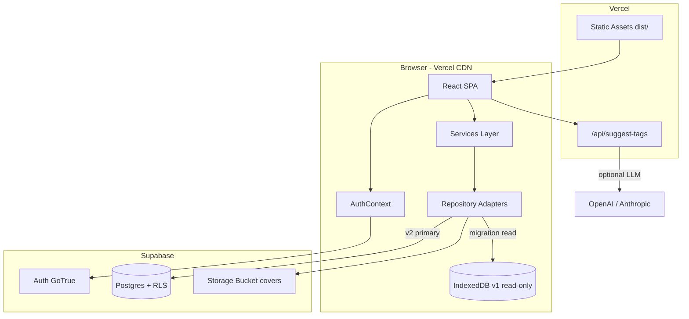
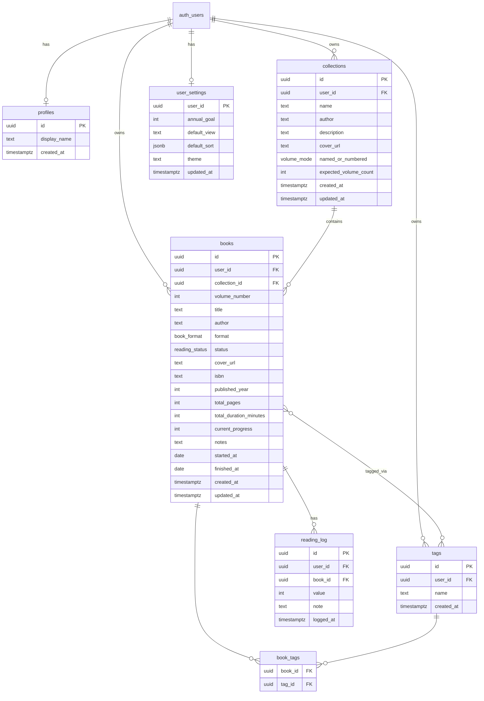

# Bookworm v2 — Technical Architecture

**Version:** 2.0  
**Status:** Approved for implementation  
**Last updated:** July 1, 2026  
**Author:** System Architect  
**PRD:** [`requirements-v2.md`](./requirements-v2.md) v2.1

---

## Table of Contents

1. [Executive Summary](#1-executive-summary)
2. [Requirements Summary](#2-requirements-summary)
3. [High-Level Architecture](#3-high-level-architecture)
4. [Technology Stack](#4-technology-stack)
5. [Database Design](#5-database-design)
6. [Authentication & Authorization](#6-authentication--authorization)
7. [Application Architecture](#7-application-architecture)
8. [Feature Designs](#8-feature-designs)
9. [API & Service Contracts](#9-api--service-contracts)
10. [Vercel & Supabase Deployment](#10-vercel--supabase-deployment)
11. [v1 Migration Strategy](#11-v1-migration-strategy)
12. [Implementation Plan](#12-implementation-plan)
13. [Architecture Decision Records](#13-architecture-decision-records)
14. [Risks & Failure Modes](#14-risks--failure-modes)

---

## 1. Executive Summary

Bookworm v2 transforms the v1 **browser-only SPA** (IndexedDB via Dexie) into a **cloud-backed multi-user application** while preserving the existing React + Vite frontend and Vercel deployment.

**Core architectural shift:**

```
v1:  React → Services → Repositories → Dexie (IndexedDB)

v2:  React → Services → Repositories → Supabase Client → Postgres (RLS)
                                      ↘ Edge Function (tag suggestions)
                                      ↘ Storage (cover images)
```

**Platform choices:**

| Concern | Choice |
|---------|--------|
| Hosting | Vercel (existing) |
| Database | Supabase Postgres |
| Auth | Supabase Auth (email/password) |
| File storage | Supabase Storage |
| Row security | Postgres RLS policies |
| Tag suggestions | Vercel Serverless Function + rules fallback |

**Phased delivery** mirrors the PRD: **2.0** (auth + cloud), **2.1** (tags + collections), **2.2** (dashboard).

---

## 2. Requirements Summary

### Functional (from PRD)

| Phase | Stories | Capability |
|-------|---------|------------|
| 2.0 | US-20, US-21, US-22 | Email/password auth, cloud persistence, v1 migration |
| 2.1 | US-23–26, US-28 | Auto-tags, collections (named/numbered), delete with keep-books |
| 2.2 | US-27 | Per-user statistics dashboard |

### Non-Functional

| NFR | Target |
|-----|--------|
| **Security** | RLS on all user data; JWT session; no cross-user reads |
| **Availability** | Online-first; graceful degradation on network failure |
| **Latency** | Library load < 2s on 4G; tag suggestions < 3s (p95) |
| **Scale** | Personal libraries (< 5k books/user); no multi-tenant admin |
| **Portability** | JSON export/import retained per user |
| **Cost** | Supabase free tier + Vercel hobby; rules-based tags default |

### Product Invariants (enforced in services + DB)

1. Collections must have **≥ 1 book** at all times.
2. Collection delete defaults to **keep books** (unlink).
3. Email/password **only** for v2.0–v2.2.
4. Tag suggestions are **non-blocking**; user confirms before save.

---

## 3. High-Level Architecture



### Request flow (authenticated CRUD)

```
1. User signs in → Supabase Auth returns JWT (stored in session)
2. Supabase client attaches JWT to every query
3. Postgres RLS policies filter rows by auth.uid()
4. Service layer applies business rules (status transitions, collection invariants)
5. Repository executes Supabase .from('books').select() etc.
6. UI refreshes via hooks
```

---

## 4. Technology Stack

### 4.1 Additions to v1 stack

| Layer | Package | Purpose |
|-------|---------|---------|
| Backend-as-a-service | `@supabase/supabase-js` | Auth, Postgres, Storage client |
| Serverless API | Vercel Functions (`/api/*`) | Tag suggestion endpoint |
| Env config | `VITE_SUPABASE_URL`, `VITE_SUPABASE_ANON_KEY` | Client bootstrap |

### 4.2 Retained from v1

React 19, TypeScript, Vite, React Router 7, Tailwind CSS 4, Zod, date-fns, Lucide, Vitest.

### 4.3 Removed / demoted in v2.0

| Item | v2.0 behavior |
|------|---------------|
| Dexie / IndexedDB | Read-only for v1 migration; removed as primary store after migration |
| `fake-indexeddb` tests | Replaced with Supabase mock / integration tests against local Supabase |

### 4.4 Optional (v2.1+)

| Item | When |
|------|------|
| `@supabase/ssr` | Only if SSR added later; SPA uses browser client |
| LLM SDK (OpenAI) | Tag suggestions if rules fallback insufficient |

---

## 5. Database Design

### 5.1 Entity Relationship



### 5.2 SQL Schema

```sql
-- Enums
CREATE TYPE book_format AS ENUM ('physical', 'ebook', 'audiobook');
CREATE TYPE reading_status AS ENUM ('want_to_read', 'currently_reading', 'finished', 'dnf');
CREATE TYPE volume_mode AS ENUM ('named', 'numbered');

-- Profile (extends auth.users)
CREATE TABLE profiles (
  id          UUID PRIMARY KEY REFERENCES auth.users(id) ON DELETE CASCADE,
  display_name TEXT,
  created_at  TIMESTAMPTZ NOT NULL DEFAULT now()
);

-- Collections
CREATE TABLE collections (
  id                    UUID PRIMARY KEY DEFAULT gen_random_uuid(),
  user_id               UUID NOT NULL REFERENCES auth.users(id) ON DELETE CASCADE,
  name                  TEXT NOT NULL,
  author                TEXT NOT NULL,
  description           TEXT NOT NULL DEFAULT '',
  cover_url             TEXT,
  volume_mode           volume_mode NOT NULL,
  expected_volume_count INT CHECK (expected_volume_count IS NULL OR expected_volume_count >= 1),
  created_at            TIMESTAMPTZ NOT NULL DEFAULT now(),
  updated_at            TIMESTAMPTZ NOT NULL DEFAULT now()
);

CREATE INDEX collections_user_id_idx ON collections(user_id);

-- Books
CREATE TABLE books (
  id                      UUID PRIMARY KEY DEFAULT gen_random_uuid(),
  user_id                 UUID NOT NULL REFERENCES auth.users(id) ON DELETE CASCADE,
  collection_id           UUID REFERENCES collections(id) ON DELETE SET NULL,
  volume_number           INT CHECK (volume_number IS NULL OR volume_number >= 1),
  title                   TEXT NOT NULL,
  author                  TEXT NOT NULL,
  format                  book_format NOT NULL DEFAULT 'physical',
  status                  reading_status NOT NULL DEFAULT 'want_to_read',
  cover_url               TEXT,
  isbn                    TEXT,
  published_year          INT,
  total_pages             INT,
  total_duration_minutes  INT,
  current_progress        INT NOT NULL DEFAULT 0,
  notes                   TEXT NOT NULL DEFAULT '',
  started_at              DATE,
  finished_at             DATE,
  created_at              TIMESTAMPTZ NOT NULL DEFAULT now(),
  updated_at              TIMESTAMPTZ NOT NULL DEFAULT now(),

  CONSTRAINT numbered_volume_requires_number CHECK (
    volume_number IS NOT NULL OR collection_id IS NULL
    -- numbered mode enforced in app layer when collection.volume_mode = 'numbered'
  )
);

CREATE INDEX books_user_id_idx ON books(user_id);
CREATE INDEX books_collection_id_idx ON books(collection_id);
CREATE INDEX books_status_idx ON books(user_id, status);
CREATE INDEX books_finished_at_idx ON books(user_id, finished_at);

-- Tags (normalized, per-user unique name)
CREATE TABLE tags (
  id         UUID PRIMARY KEY DEFAULT gen_random_uuid(),
  user_id    UUID NOT NULL REFERENCES auth.users(id) ON DELETE CASCADE,
  name       TEXT NOT NULL,
  created_at TIMESTAMPTZ NOT NULL DEFAULT now(),
  UNIQUE (user_id, name)
);

CREATE INDEX tags_user_id_idx ON tags(user_id);

-- Book ↔ Tag junction
CREATE TABLE book_tags (
  book_id UUID NOT NULL REFERENCES books(id) ON DELETE CASCADE,
  tag_id  UUID NOT NULL REFERENCES tags(id) ON DELETE CASCADE,
  PRIMARY KEY (book_id, tag_id)
);

CREATE INDEX book_tags_tag_id_idx ON book_tags(tag_id);

-- Reading log
CREATE TABLE reading_log (
  id         UUID PRIMARY KEY DEFAULT gen_random_uuid(),
  user_id    UUID NOT NULL REFERENCES auth.users(id) ON DELETE CASCADE,
  book_id    UUID NOT NULL REFERENCES books(id) ON DELETE CASCADE,
  value      INT NOT NULL,
  note       TEXT,
  logged_at  TIMESTAMPTZ NOT NULL DEFAULT now()
);

CREATE INDEX reading_log_book_id_idx ON reading_log(book_id, logged_at DESC);

-- User settings (one row per user)
CREATE TABLE user_settings (
  user_id       UUID PRIMARY KEY REFERENCES auth.users(id) ON DELETE CASCADE,
  annual_goal   INT,
  default_view  TEXT NOT NULL DEFAULT 'list',
  default_sort  JSONB NOT NULL DEFAULT '{"field":"created_at","direction":"desc"}',
  theme         TEXT NOT NULL DEFAULT 'light',
  updated_at    TIMESTAMPTZ NOT NULL DEFAULT now()
);

-- Migration tracking (prevent duplicate v1 imports)
CREATE TABLE migration_runs (
  user_id     UUID PRIMARY KEY REFERENCES auth.users(id) ON DELETE CASCADE,
  migrated_at TIMESTAMPTZ NOT NULL DEFAULT now(),
  books_added INT NOT NULL DEFAULT 0,
  logs_added  INT NOT NULL DEFAULT 0
);
```

### 5.3 Collection Invariants (application + triggers)

**Create collection:** Single transaction inserts `collections` row + ≥ 1 `books` row with `collection_id` set.

**Delete collection — keep books (default):**

```sql
BEGIN;
  UPDATE books
    SET collection_id = NULL, volume_number = NULL, updated_at = now()
    WHERE collection_id = $1 AND user_id = auth.uid();
  DELETE FROM collections WHERE id = $1 AND user_id = auth.uid();
COMMIT;
```

**Delete collection — delete all:**

```sql
BEGIN;
  DELETE FROM reading_log WHERE book_id IN (
    SELECT id FROM books WHERE collection_id = $1 AND user_id = auth.uid()
  );
  DELETE FROM books WHERE collection_id = $1 AND user_id = auth.uid();
  DELETE FROM collections WHERE id = $1 AND user_id = auth.uid();
COMMIT;
```

**Delete last book in collection:** Service checks `COUNT(*) WHERE collection_id = ?`. If count = 1, UI forces Flow N (delete book+collection OR unlink book+delete collection). Never run bare `DELETE FROM books` without this check.

**Optional DB trigger** (belt-and-suspenders):

```sql
CREATE OR REPLACE FUNCTION prevent_empty_collection()
RETURNS TRIGGER AS $$
BEGIN
  IF TG_OP = 'DELETE' AND OLD.collection_id IS NOT NULL THEN
    IF NOT EXISTS (
      SELECT 1 FROM books
      WHERE collection_id = OLD.collection_id AND id <> OLD.id
    ) THEN
      DELETE FROM collections WHERE id = OLD.collection_id;
    END IF;
  END IF;
  RETURN OLD;
END;
$$ LANGUAGE plpgsql;
```

App layer remains primary enforcer; trigger only auto-deletes orphaned collection shells.

### 5.4 Row-Level Security Policies

Enable RLS on all tables. Pattern: `user_id = auth.uid()` (or `id = auth.uid()` for profiles/settings).

```sql
ALTER TABLE books ENABLE ROW LEVEL SECURITY;

CREATE POLICY books_select ON books FOR SELECT
  USING (user_id = auth.uid());
CREATE POLICY books_insert ON books FOR INSERT
  WITH CHECK (user_id = auth.uid());
CREATE POLICY books_update ON books FOR UPDATE
  USING (user_id = auth.uid());
CREATE POLICY books_delete ON books FOR DELETE
  USING (user_id = auth.uid());

-- Repeat for collections, tags, book_tags, reading_log, user_settings, migration_runs
-- book_tags: check book ownership via subquery
CREATE POLICY book_tags_all ON book_tags FOR ALL
  USING (EXISTS (
    SELECT 1 FROM books WHERE books.id = book_tags.book_id AND books.user_id = auth.uid()
  ));
```

**Storage bucket `covers`:** Policy allows read/write only under `{user_id}/*` path prefix.

### 5.5 Dashboard Queries

For v2.2, use **Postgres RPC functions** to avoid shipping large datasets for stats:

```sql
CREATE OR REPLACE FUNCTION get_dashboard_stats(p_user_id UUID)
RETURNS JSON
LANGUAGE plpgsql SECURITY DEFINER
SET search_path = public
AS $$
BEGIN
  IF p_user_id <> auth.uid() THEN
    RAISE EXCEPTION 'forbidden';
  END IF;
  RETURN json_build_object(
    'total_books', (SELECT count(*) FROM books WHERE user_id = p_user_id),
    'currently_reading', (SELECT count(*) FROM books WHERE user_id = p_user_id AND status = 'currently_reading'),
    'finished_all_time', (SELECT count(*) FROM books WHERE user_id = p_user_id AND status = 'finished'),
    'finished_this_year', (
      SELECT count(*) FROM books
      WHERE user_id = p_user_id AND status = 'finished'
        AND finished_at >= date_trunc('year', CURRENT_DATE)
    ),
    'by_status', (SELECT json_object_agg(status, cnt) FROM (
      SELECT status, count(*) cnt FROM books WHERE user_id = p_user_id GROUP BY status
    ) s),
    'by_format', (SELECT json_object_agg(format, cnt) FROM (
      SELECT format, count(*) cnt FROM books WHERE user_id = p_user_id GROUP BY format
    ) f)
    -- additional fields: recent_finished, top_tags, collection_progress, pace
  );
END;
$$;
```

Client calls `supabase.rpc('get_dashboard_stats', { p_user_id: user.id })`.

---

## 6. Authentication & Authorization

### 6.1 Auth Flow

| Flow | Implementation |
|------|----------------|
| Sign up | `supabase.auth.signUp({ email, password })` |
| Sign in | `supabase.auth.signInWithPassword({ email, password })` |
| Sign out | `supabase.auth.signOut()` |
| Session | `supabase.auth.getSession()` + `onAuthStateChange` |
| Password reset | `supabase.auth.resetPasswordForEmail()` → `/reset-password` route |

### 6.2 Frontend Auth Layer

```
src/
├── lib/
│   └── supabase.ts          # createClient(VITE_SUPABASE_URL, VITE_SUPABASE_ANON_KEY)
├── context/
│   └── AuthContext.tsx      # session, user, loading, signIn/signUp/signOut
├── components/
│   └── auth/
│       ├── LoginPage.tsx
│       ├── SignUpPage.tsx
│       ├── ResetPasswordPage.tsx
│       └── ProtectedRoute.tsx
```

**`ProtectedRoute`:** Wraps `AppShell`; redirects to `/login` if no session. Public routes: `/login`, `/signup`, `/reset-password`.

### 6.3 Profile Bootstrap

On first sign-up, insert `profiles` row via Supabase trigger:

```sql
CREATE OR REPLACE FUNCTION handle_new_user()
RETURNS TRIGGER AS $$
BEGIN
  INSERT INTO profiles (id) VALUES (NEW.id);
  INSERT INTO user_settings (user_id) VALUES (NEW.id);
  RETURN NEW;
END;
$$ LANGUAGE plpgsql SECURITY DEFINER;

CREATE TRIGGER on_auth_user_created
  AFTER INSERT ON auth.users
  FOR EACH ROW EXECUTE FUNCTION handle_new_user();
```

### 6.4 Authorization Model

- **No custom roles** in v2; every authenticated user is equal.
- All authorization via RLS; never trust client-side `user_id` without DB policy.
- Service layer still sets `user_id` from session on inserts for clarity.

---

## 7. Application Architecture

### 7.1 Repository Abstraction

Introduce a **storage provider interface** so services stay unchanged in shape:

```typescript
// src/repositories/types.ts
export interface BookRepository {
  getAll(): Promise<Book[]>
  getById(id: string): Promise<Book | undefined>
  create(book: Book): Promise<string>
  update(id: string, changes: Partial<Book>): Promise<void>
  delete(id: string): Promise<void>
  getByCollectionId(collectionId: string): Promise<Book[]>
  unlinkFromCollection(collectionId: string): Promise<void>
  // ...
}
```

**Implementations:**

| Class | Phase | Storage |
|-------|-------|---------|
| `DexieBookRepository` | v1 / migration | IndexedDB |
| `SupabaseBookRepository` | v2.0+ | Postgres |

**Factory:**

```typescript
// src/repositories/index.ts
export const bookRepository = import.meta.env.VITE_USE_SUPABASE === 'true'
  ? supabaseBookRepository
  : dexieBookRepository
```

After v2.0 ships, remove Dexie implementation except migration reader.

### 7.2 Extended TypeScript Types

```typescript
// src/types/collection.ts
export type VolumeMode = 'named' | 'numbered'

export interface Collection {
  id: string
  user_id: string
  name: string
  author: string
  description: string
  cover_url: string | null
  volume_mode: VolumeMode
  expected_volume_count: number | null
  created_at: string
  updated_at: string
  // computed client-side or via join:
  book_count?: number
  finished_count?: number
}

// src/types/tag.ts
export interface Tag {
  id: string
  user_id: string
  name: string
}

// Book extended
export interface Book {
  // ...existing fields
  user_id: string
  collection_id: string | null
  volume_number: number | null
  tags?: Tag[]  // populated via join
}
```

### 7.3 New Services

| Service | Responsibility |
|---------|----------------|
| `auth.service.ts` | Thin wrapper over Supabase auth |
| `collection.service.ts` | Create (atomic), delete (keep/delete all), stats |
| `tag.service.ts` | CRUD tags, attach/detach, normalize names |
| `tag-suggestion.service.ts` | Call `/api/suggest-tags`, fallback rules |
| `dashboard.service.ts` | RPC call + widget data shaping |
| `migration.service.ts` | Dexie → Supabase bulk import |
| `cover.service.ts` | Upload to Storage; return public/signed URL |

### 7.4 Routing (v2.2 target)

| Path | Component | Auth |
|------|-----------|------|
| `/` | `DashboardPage` | Protected |
| `/library` | `LibraryPage` | Protected |
| `/books/new` | `AddEntryPage` (book or collection chooser) | Protected |
| `/books/:id` | `BookDetailPage` | Protected |
| `/books/:id/edit` | `EditBookPage` | Protected |
| `/collections/new` | `AddCollectionPage` | Protected |
| `/collections/:id` | `CollectionDetailPage` | Protected |
| `/settings` | `SettingsPage` | Protected |
| `/login` | `LoginPage` | Public |
| `/signup` | `SignUpPage` | Public |
| `/reset-password` | `ResetPasswordPage` | Public |

**v2.0 interim:** `/` remains `LibraryPage` until dashboard ships in 2.2.

### 7.5 Component Additions

```
src/components/
├── auth/           LoginPage, SignUpPage, ProtectedRoute, MigrationPrompt
├── dashboard/      DashboardPage, SummaryCards, StatusChart, FormatChart, ...
├── collections/    CollectionDetailPage, AddCollectionPage, CollectionCard,
│                   DeleteCollectionDialog, VolumeList
├── tags/           TagInput, TagChips, TagFilter
└── forms/
    └── AddEntryPage.tsx   # Single book | Collection chooser
```

### 7.6 State Management (unchanged pattern)

| State | Mechanism |
|-------|-----------|
| Auth session | `AuthContext` |
| Persistent data | Supabase via hooks |
| URL filters | `useSearchParams` (add `?tags=`, `?view=collections`) |
| Toasts | `ToastContext` |

---

## 8. Feature Designs

### 8.1 Auto-Tag Suggestions (US-23)

**Architecture:**

```
BookForm (title, author, notes filled)
  → debounce 500ms
  → tagSuggestionService.suggest({ title, author, notes, format })
      → POST /api/suggest-tags (Vercel Function)
          → try rules engine (genre keywords, format hints)
          → if OPENAI_API_KEY set AND rules return < 3: LLM completion
          → cache in memory keyed by hash(title+author) for session
  → TagInput shows 3–5 chips (editable)
  → on save: tagService.setBookTags(bookId, confirmedTags)
```

**Rules fallback (always available, no API key):**

```typescript
const GENRE_KEYWORDS: Record<string, string[]> = {
  fantasy: ['dragon', 'magic', 'wizard', 'quest', 'kingdom'],
  'sci-fi': ['space', 'planet', 'future', 'robot', 'alien'],
  mystery: ['murder', 'detective', 'crime', 'investigation'],
  memoir: ['memoir', 'autobiography', 'life story'],
  // ...
}
```

Returns 3–5 normalized lowercase tags. **Never blocks book save** on failure.

**On edit:** Suggestions only when user clicks "Suggest tags" (per PRD).

### 8.2 Collections (US-24–26, US-28)

**Create (atomic transaction via service):**

```typescript
async createCollection(input: CreateCollectionInput, volumes: CreateVolumeInput[]): Promise<Collection> {
  if (volumes.length < 1) throw new ValidationError('At least one book required')

  return supabase.rpc('create_collection_with_volumes', { ... })
  // OR client-side transaction: insert collection → bulk insert books
}
```

**Numbered mode:** Each volume `title = collection.name`, `volume_number = 1..N`.

**Named mode:** Each volume has unique `title`; `volume_number` optional.

**Library display:**

| Mode | List label |
|------|------------|
| Named | `{volume.title}` + badge `{collection.name}` |
| Numbered | `{collection.name} · Vol. {n}` |
| Standalone | `{book.title}` |

**Delete dialog (US-28):** `DeleteCollectionDialog` with radio default `keep_books`.

### 8.3 Dashboard (US-27)

**Data source:** `dashboard.service.getStats()` → Supabase RPC.

**Widgets → navigation:**

| Widget tap | Route |
|------------|-------|
| Finished this year | `/library?status=finished&year=2026` |
| Currently reading | `/library?status=currently_reading` |
| Collection progress | `/collections/:id` |

**Charts:** Lightweight CSS bars or `recharts` (add only in 2.2 if needed).

### 8.4 Cover Images

| Source | Storage |
|--------|---------|
| URL | Store URL string in `cover_url` |
| File upload | Upload to `covers/{user_id}/{book_id}.{ext}` → store Storage public URL |

Max 2MB; jpeg/png/webp. v1 base64 imports converted to Storage upload during migration.

---

## 9. API & Service Contracts

### 9.1 Vercel Function: `POST /api/suggest-tags`

**Request:**

```json
{
  "title": "The Way of Kings",
  "author": "Brandon Sanderson",
  "notes": "Epic fantasy, start of Stormlight Archive",
  "format": "physical"
}
```

**Response:**

```json
{
  "tags": ["fantasy", "epic", "series"],
  "source": "rules" | "llm"
}
```

**Auth:** Require `Authorization: Bearer <supabase_jwt>`; verify JWT in function before processing.

### 9.2 CollectionService

```typescript
interface CollectionService {
  getAll(): Promise<Collection[]>
  getById(id: string): Promise<Collection | null>
  create(input: CreateCollectionInput, volumes: CreateVolumeInput[]): Promise<Collection>
  delete(id: string, mode: 'keep_books' | 'delete_all'): Promise<void>
  getStats(id: string): Promise<{ total: number; finished: number; percent: number }>
  addVolume(collectionId: string, volume: CreateVolumeInput): Promise<Book>
  removeVolume(bookId: string, lastBookAction: 'delete_collection' | 'unlink'): Promise<void>
}
```

### 9.3 TagService

```typescript
interface TagService {
  suggest(input: SuggestTagsInput): Promise<string[]>
  normalize(name: string): string  // lowercase, trim, max 30
  setBookTags(bookId: string, tagNames: string[]): Promise<Tag[]>
  getAllForUser(): Promise<Tag[]>
  searchBooksByTags(tagIds: string[], match: 'all' | 'any'): Promise<Book[]>
}
```

### 9.4 MigrationService

```typescript
interface MigrationService {
  hasLocalV1Data(): Promise<boolean>
  hasMigrated(): Promise<boolean>  // checks migration_runs
  migrate(): Promise<MigrationResult>
}

interface MigrationResult {
  booksAdded: number
  booksSkipped: number
  logsAdded: number
}
```

**Algorithm:**

```
1. Read all books, logs, settings from Dexie
2. If migration_runs row exists for user → return skipped
3. BEGIN bulk upsert books (ON CONFLICT id DO NOTHING)
4. Bulk upsert reading_log
5. Upsert user_settings
6. Insert migration_runs
7. Return counts
```

Preserves v1 UUIDs for idempotent merge.

### 9.5 Export / Import (updated)

`ExportBundle` version → `2`. Adds `collections`, `tags`, `book_tags`. Import validates user is signed in; all imported rows get `user_id` from session.

---

## 10. Vercel & Supabase Deployment

### 10.1 Environment Variables

| Variable | Where | Purpose |
|----------|-------|---------|
| `VITE_SUPABASE_URL` | Vercel + local | Supabase project URL |
| `VITE_SUPABASE_ANON_KEY` | Vercel + local | Public anon key |
| `SUPABASE_SERVICE_ROLE_KEY` | Vercel Functions only | JWT verify / admin tasks (never expose to client) |
| `OPENAI_API_KEY` | Vercel Functions (optional) | LLM tag fallback |

### 10.2 Vercel Configuration

Add API routes under `/api/` (Vercel auto-detects `api/` folder or `vercel.json` functions config).

`vercel.json` unchanged for SPA rewrites; API routes excluded automatically.

### 10.3 Supabase Project Setup

1. Create project; run migration SQL (schema + RLS + triggers + RPC).
2. Enable email auth; configure site URL + redirect URLs for Vercel domain.
3. Create Storage bucket `covers` with RLS policies.
4. Add Vercel production URL to allowed redirect URLs.

### 10.4 Local Development

```bash
# Option A: Supabase cloud dev project
cp .env.example .env.local

# Option B: Supabase CLI local stack
supabase start
supabase db reset
```

---

## 11. v1 Migration Strategy

### 11.1 Detection

On sign-in, `MigrationPrompt` checks:

1. `migrationService.hasMigrated()` → false
2. `migrationService.hasLocalV1Data()` → Dexie `books.count() > 0`

### 11.2 UX

Modal with **Migrate now** / **Skip**. Skip sets `localStorage.bookworm_migration_dismissed = true` (does not block future offers).

### 11.3 Data Mapping

| v1 (Dexie) | v2 (Postgres) |
|------------|---------------|
| `Book` | `books` (+ `user_id`) |
| `ReadingLogEntry` | `reading_log` (+ `user_id`) |
| `UserSettings` | `user_settings` |
| base64 `cover_url` | Upload to Storage; replace with URL |
| — | `collections`, `tags` empty post-migration |

### 11.4 Rollback

Migration is additive (upsert). v1 IndexedDB untouched. User can export from v2 if needed.

---

## 12. Implementation Plan

### Phase 2.0 — Foundation (estimate: 2–3 weeks)

| Step | Deliverable |
|------|-------------|
| 2.0.1 | Supabase project, schema migration, RLS policies |
| 2.0.2 | `src/lib/supabase.ts`, `AuthContext`, login/signup pages |
| 2.0.3 | `SupabaseBookRepository`, `SupabaseReadingLogRepository`, `SupabaseSettingsRepository` |
| 2.0.4 | Wire services to Supabase repos; feature flag `VITE_USE_SUPABASE` |
| 2.0.5 | `ProtectedRoute`; gate existing pages |
| 2.0.6 | `migration.service.ts` + `MigrationPrompt` |
| 2.0.7 | Cover upload to Storage |
| 2.0.8 | Update export/import for v2 schema |
| 2.0.9 | Env vars on Vercel; E2E smoke test sign-up → add book → reload |
| 2.0.10 | Password reset (2.0.1 polish if needed) |

### Phase 2.1 — Organization (estimate: 2 weeks)

| Step | Deliverable |
|------|-------------|
| 2.1.1 | `tags`, `book_tags` tables + `TagService` + `TagInput` |
| 2.1.2 | `/api/suggest-tags` + rules engine + `TagSuggestionService` |
| 2.1.3 | Tag filter in library search |
| 2.1.4 | `collections` table + `CollectionService` |
| 2.1.5 | `AddEntryPage`, `AddCollectionPage` (named + numbered) |
| 2.1.6 | `CollectionDetailPage`, library collections tab |
| 2.1.7 | `DeleteCollectionDialog` (keep books default) |
| 2.1.8 | Last-book-in-collection flow |

### Phase 2.2 — Dashboard (estimate: 1 week)

| Step | Deliverable |
|------|-------------|
| 2.2.1 | `get_dashboard_stats` RPC + `DashboardService` |
| 2.2.2 | `DashboardPage` + widget components |
| 2.2.3 | Move `/` to dashboard; `/library` for library |
| 2.2.4 | Widget → filtered library navigation |
| 2.2.5 | Bottom nav: Dashboard, Library, Add, Settings |

### Testing Strategy

| Layer | Tool |
|-------|------|
| Repositories | Vitest + Supabase local or mocked client |
| Services | Vitest unit tests |
| RLS | SQL tests in Supabase CI |
| Auth flows | Playwright (optional) |
| Migration | Integration: seed Dexie → migrate → verify Postgres |

---

## 13. Architecture Decision Records

### ADR-011: Supabase as BaaS

| | |
|---|---|
| **Status** | Accepted |
| **Context** | Need Postgres, auth, storage, RLS for multi-user SPA on Vercel |
| **Decision** | Supabase (Postgres + GoTrue + Storage) |
| **Consequences** | + Fast setup, RLS, auth built-in. − Vendor coupling; Postgres-specific SQL |
| **Alternatives rejected** | Firebase (NoSQL mismatch); custom Express API (ops overhead); PlanetScale (no built-in auth/storage) |

### ADR-012: Repository adapter pattern for storage migration

| | |
|---|---|
| **Status** | Accepted |
| **Context** | v1 uses Dexie; v2 uses Supabase; services should not rewrite |
| **Decision** | Interface + `SupabaseXRepository` / `DexieXRepository` factory |
| **Consequences** | + Incremental migration; testable. − Temporary dual implementations |

### ADR-013: Normalized tags with junction table

| | |
|---|---|
| **Status** | Accepted |
| **Context** | Filter by tag, top-tags dashboard, per-user uniqueness |
| **Decision** | `tags` + `book_tags` tables; unique `(user_id, name)` |
| **Consequences** | + Efficient tag queries. − Extra joins (acceptable at scale) |
| **Alternatives rejected** | `text[]` on books (harder to aggregate top tags) |

### ADR-014: Rules-first tag suggestions

| | |
|---|---|
| **Status** | Accepted |
| **Context** | LLM cost/latency; PRD requires non-blocking fallback |
| **Decision** | Keyword rules engine default; optional LLM enhancement server-side |
| **Consequences** | + Zero cost baseline; works offline for rules in future. − Less nuanced than pure LLM |

### ADR-015: Collection delete default = keep books

| | |
|---|---|
| **Status** | Accepted |
| **Context** | PM decision; prevent accidental data loss |
| **Decision** | `DELETE collection` clears FK on books; destructive path requires extra confirm |
| **Consequences** | + Safer UX. − Orphan standalone books may need manual re-grouping |

### ADR-016: Dashboard stats via Postgres RPC

| | |
|---|---|
| **Status** | Accepted |
| **Context** | Multiple aggregate widgets; avoid over-fetching all books |
| **Decision** | `get_dashboard_stats()` SECURITY DEFINER with `auth.uid()` check |
| **Consequences** | + Single round-trip; consistent numbers. − SQL maintenance |
| **Alternatives rejected** | Client-side aggregation (OK for <500 books but inconsistent as library grows) |

### ADR-017: Online-first; Dexie demoted

| | |
|---|---|
| **Status** | Accepted |
| **Context** | Cloud is source of truth in v2 |
| **Decision** | No offline write cache in 2.0; IndexedDB only for v1 migration read |
| **Consequences** | + Simpler consistency model. − No offline editing until 2.3+ |

### ADR-018: Email/password auth only

| | |
|---|---|
| **Status** | Accepted |
| **Context** | PM decision for v2.0–v2.2 |
| **Decision** | Supabase `signInWithPassword` only; no OAuth providers enabled |
| **Consequences** | + Simpler auth UI. − Add OAuth later requires provider config |

---

## 14. Risks & Failure Modes

| Risk | Mitigation |
|------|------------|
| RLS misconfiguration exposes data | Automated policy tests; never use service role key in client |
| Migration duplicates | Upsert on `id`; `migration_runs` guard |
| Collection orphan / empty state | Service validation + optional trigger |
| Tag API abuse | Require valid JWT; rate limit in Vercel function |
| Large base64 covers in migration | Stream upload to Storage; size cap |
| Supabase free tier limits | Monitor row counts; personal use well within limits |
| Session expiry mid-edit | AuthContext refresh; toast + redirect on 401 |

---

## Appendix: New Project Structure (v2 target)

```
bookworm/
├── api/
│   └── suggest-tags.ts          # Vercel serverless
├── supabase/
│   └── migrations/
│       └── 20260701000000_v2_schema.sql
├── src/
│   ├── lib/supabase.ts
│   ├── context/AuthContext.tsx
│   ├── repositories/
│   │   ├── types.ts
│   │   ├── supabase/
│   │   │   ├── book.repository.ts
│   │   │   ├── collection.repository.ts
│   │   │   ├── tag.repository.ts
│   │   │   └── ...
│   │   └── dexie/               # migration only, remove later
│   ├── services/
│   │   ├── auth.service.ts
│   │   ├── collection.service.ts
│   │   ├── tag.service.ts
│   │   ├── tag-suggestion.service.ts
│   │   ├── dashboard.service.ts
│   │   └── migration.service.ts
│   ├── components/
│   │   ├── auth/
│   │   ├── dashboard/
│   │   ├── collections/
│   │   └── tags/
│   └── types/
│       ├── collection.ts
│       └── tag.ts
```

---

*Implementation begins with Phase 2.0. Senior Engineer should create Supabase migration and auth shell first, then swap repositories behind the existing service layer.*